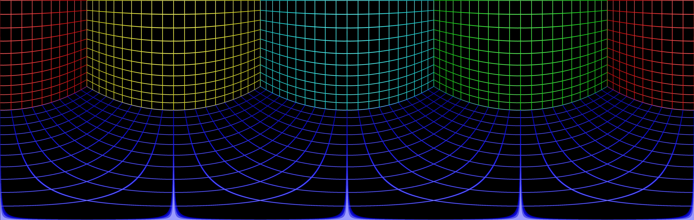

# Top-Down Fisheye Image Dewarp and Rewarp


Implementation of the algorithm for dewarpping and rewarpping on a fisheye image by using OpenCV.

## Usage

```bash
python3 main.py
```

## Mesh




> The source of mesh image is from (http://paulbourke.net/dome/fish2/).