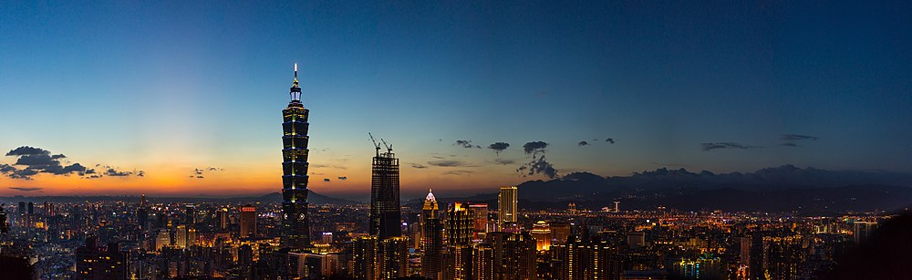
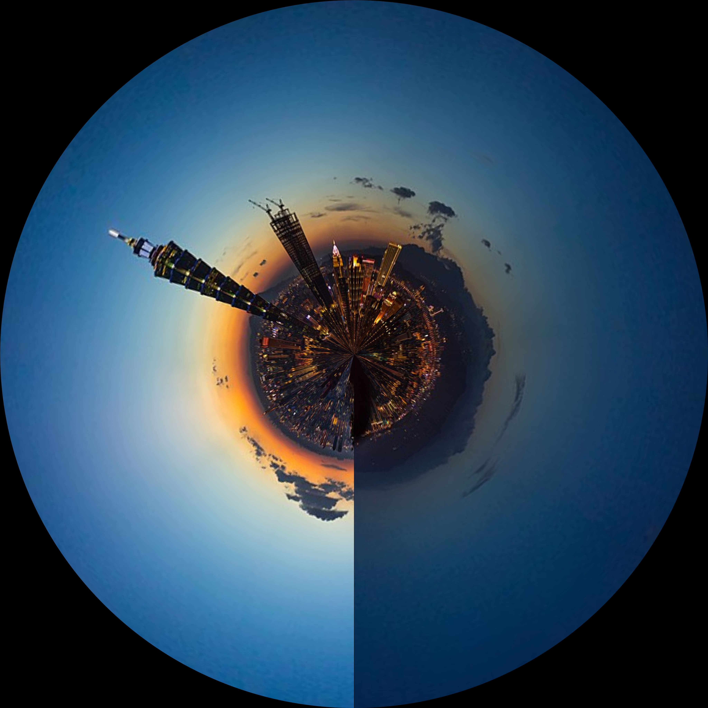
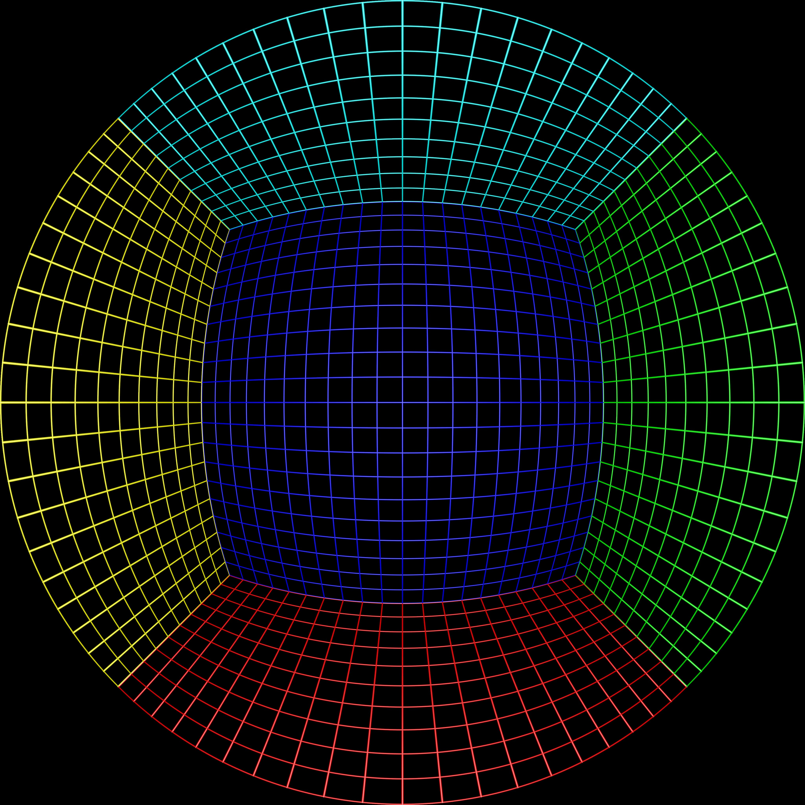
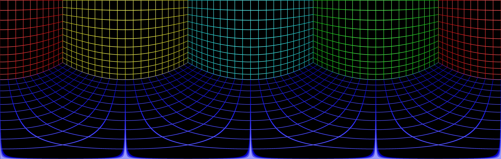

<div align="center" style="text-align: center">

# **Fisheye Warping**

<p style="text-align: center">
  
  <div></div>
  
</p>

[](https://pypi.python.org/pypi/FisheyeWarping/) [](https://pypi.python.org/pypi/FisheyeWarping/)

[](https://github.com/NatLee/Eagle-Wrappger/actions/workflows/test.yml) [](https://github.com/NatLee/fisheye-warping/actions/workflows/release.yml)

[](https://pypi.python.org/pypi/FisheyeWarping/) [](https://pypi.python.org/pypi/FisheyeWarping/)

[](https://pypi.python.org/pypi/FisheyeWarping/)

[](https://pypi.python.org/pypi/FisheyeWarping/) [](https://pypi.python.org/pypi/FisheyeWarping/) [](https://pypi.python.org/pypi/FisheyeWarping/)

[](https://www.python.org/)

</div>

A tool for dewarping and rewarping on a top-down fisheye image by using OpenCV on Python.

## Installation

```bash
pip install FisheyeWarping
```

## Usage

```bash
fisheyewarping --help
```

```
usage: fisheyewarping [-h] [--panorama_output PANORAMA_OUTPUT] [--fisheye_output FISHEYE_OUTPUT] [--save_dewarp_mesh_path SAVE_DEWARP_MESH_PATH] [--save_rewarp_mesh_path SAVE_REWARP_MESH_PATH] [--load_dewarp_mesh_path LOAD_DEWARP_MESH_PATH]
                      [--load_rewarp_mesh_path LOAD_REWARP_MESH_PATH] [--fisheye_img_path FISHEYE_IMG_PATH] [--panorama_img_path PANORAMA_IMG_PATH] [--use_multiprocessing USE_MULTIPROCESSING]

optional arguments:
  -h, --help            show this help message and exit
  --panorama_output PANORAMA_OUTPUT
                        Specific path for `output`. Default is `./dewarp-output.png`.
  --fisheye_output FISHEYE_OUTPUT
                        Specific path for `output`. Default is `./rewarp-output.png`.
  --save_dewarp_mesh_path SAVE_DEWARP_MESH_PATH
                        Specific path for saving mesh data for `dewarping`. Default is `None`.
  --save_rewarp_mesh_path SAVE_REWARP_MESH_PATH
                        Specific path for saving mesh data for `rewarping`. Default is `None`.
  --load_dewarp_mesh_path LOAD_DEWARP_MESH_PATH
                        Specific path for loading mesh data for `dewarping`. Default is `None`.
  --load_rewarp_mesh_path LOAD_REWARP_MESH_PATH
                        Specific path for loading mesh data for `rewarping`. Default is `None`.
  --fisheye_img_path FISHEYE_IMG_PATH
                        Specific path of your fisheye image for dewarping to a panorama.
  --panorama_img_path PANORAMA_IMG_PATH
                        Specific path of your panorama image for rewarping to a fisheye image.
  --use_multiprocessing USE_MULTIPROCESSING
                        Use multiprocessing to get mesh. Default is `True`.
```

## Example

### Dewarp a fisheye image to panorama

- In the first time, you will need to build a mesh file for dewarping.

    ```bash
    fisheyewarping \
    --save_dewarp_mesh_path ./dewarp-mesh.pkl \
    --fisheye_img_path ./test-fisheye.jpg
    ```

    ```python
    import cv2
    from fisheyewarping import FisheyeWarping
    fisheye_img = cv2.imread('./test-fisheye.jpg')
    frd = FisheyeWarping(fisheye_img, use_multiprocessing=True)
    frd.build_dewarp_mesh(save_path='./dewarp-mesh.pkl')
    frd.run_dewarp(save_path='./dewarp-output.png')
    ```

- In the next time, you just load the mesh and feel free to go.

    ```bash
    fisheyewarping \
    --load_dewarp_mesh_path ./dewarp-mesh.pkl \
    --fisheye_img_path ./test-fisheye.jpg
    ```

    ```python
    import cv2
    from fisheyewarping import FisheyeWarping
    fisheye_img = cv2.imread('./test-fisheye.jpg'.)
    frd = FisheyeWarping(fisheye_img, use_multiprocessing=True)
    frd.load_dewarp_mesh(save_path='./dewarp-mesh.pkl')
    frd.run_dewarp(save_path='./dewarp-output.png')
    ```

### Rewarp any panorama image to fisheye

- In the first time, you will need to build 2 mesh files for dewarping and rewarping by using one fisheye image.

    ```bash
    fisheyewarping \
    --save_dewarp_mesh_path ./dewarp-mesh.pkl \
    --save_rewarp_mesh_path ./rewarp-mesh.pkl \
    --fisheye_img_path ./test-fisheye.jpg
    ```

    ```python
    import cv2
    from fisheyewarping import FisheyeWarping
    fisheye_img = cv2.imread('./test-fisheye.jpg'.)
    frd = FisheyeWarping(fisheye_img, use_multiprocessing=True)
    frd.build_dewarp_mesh(save_path='./dewarp-mesh.pkl')
    frd.build_rewarp_mesh(save_path='./rewarp-mesh.pkl')
    panorama_img = cv2.imread('./test-panorama.jpg'.)
    frd.run_rewarp_with_mesh(panorama_img, save_path='./rewarp-output.png')
    ```

- In the next time, you just load the meshes and feel free to go.

    ```bash
    fisheyewarping \
    --load_dewarp_mesh_path ./dewarp-mesh.pkl \
    --load_rewarp_mesh_path ./rewarp-mesh.pkl \
    --panorame_img_path ./test-panorama.jpg
    ```

    ```python
    import cv2
    from fisheyewarping import FisheyeWarping
    frd = FisheyeWarping(None, use_multiprocessing=True)
    frd.load_dewarp_mesh(save_path='./dewarp-mesh.pkl')
    frd.load_rewarp_mesh(save_path='./rewarp-mesh.pkl')
    panorama_img = cv2.imread('./test-panorama.jpg'.)
    frd.run_rewarp_with_mesh(panorama_img, save_path='./rewarp-output.png')
    ```


## Mesh

> The source of mesh image is from (http://paulbourke.net/dome/fish2/).

Here is the mesh image for this tool, it shows the transformation from the original fisheye image to the panorama image.

- Before - **Fisheye**

<div align="center" style="text-align: center">

</div>

- After - **Panorama**

<div align="center" style="text-align: center">

</div>


## Contributor

<!-- ALL-CONTRIBUTORS-LIST:START - Do not remove or modify this section -->
<!-- prettier-ignore-start -->
<!-- markdownlint-disable -->
<table>
  <tbody>
    <tr>
      <td align="center"><a href="https://github.com/NatLee"><br /><sub><b>Nat Lee</b></sub></a></td>
    </tr>
  </tbody>
</table>

<!-- markdownlint-restore -->
<!-- prettier-ignore-end -->

<!-- ALL-CONTRIBUTORS-LIST:END -->

## LICENSE

[MIT](LICENSE)


